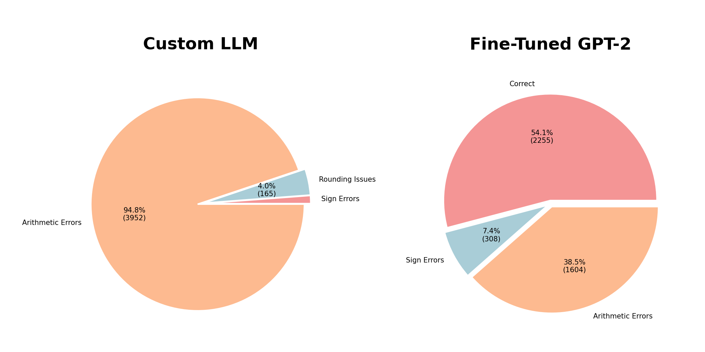
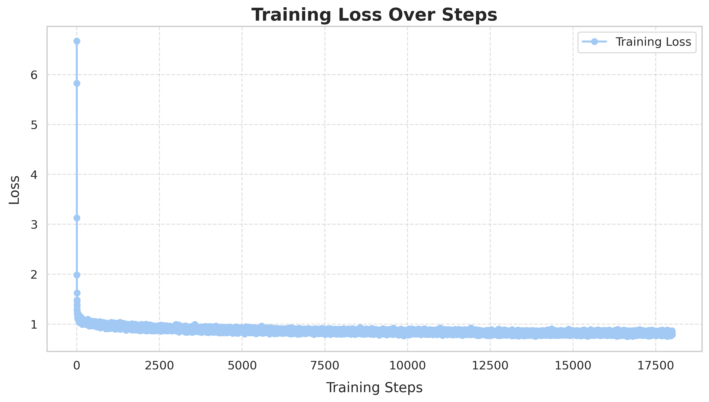
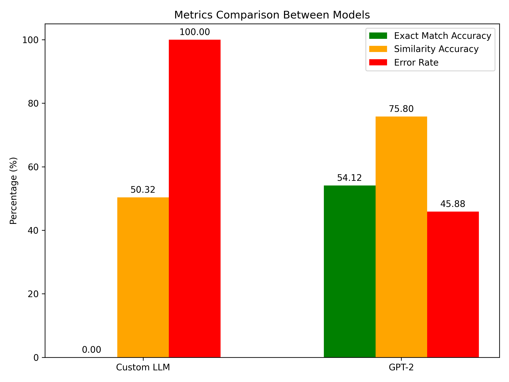

# Arithmetic LLM: Custom Transformer vs. Fine-Tuned GPT-2

## Authors

- Lokesh Poluru Velayudham - lxp334@case.edu
- Reshma Ananda Prabhakar - rxa614@case.edu
- Towsif Raiyan - txr269@case.edu

## Project Overview

This project compares the performance of a Custom Transformer Model and a fine-tuned GPT-2 on arithmetic tasks. The analysis focuses on training efficiency, accuracy, and error analysis, supplemented with visualizations to present the results effectively.

## Features
1.	**Custom Transformer Model:**
    Designed and trained from scratch to solve arithmetic tasks efficiently.
2.	**Fine-Tuned GPT-2:**
    Fine-tuned using Hugging Face’s Transformers library for arithmetic datasets.
3.	**Visual Analysis:**
    Detailed visualizations of training loss, error distribution, and accuracy comparison between models.
4.	**Evaluation and Comparison:**
    Metrics: Training loss, accuracy, and computational efficiency.

## Files and Structure

├── ArithmeticLLM.ipynb           # Implementation of the Custom Transformer model  
├── FineTuningGPT2.ipynb          # GPT-2 fine-tuning model from Hugging Face's Transformers library  
├── EvaluationAndComparison.ipynb # Evaluation and comparative analysis of the models  
├── Arithmetic.txt                # Dataset for arithmetic operations  

## Visualizations

The project includes the following visualizations to highlight model performance:

1.	**Fine-Tuning Loss Visualization:**
    Tracks the decrease in loss during GPT-2 fine-tuning.
    .png)
2.	Pretraining Loss Visualization:
    Shows the loss trend during the custom transformer model’s pretraining phase.
    .png)
3.	**Error Analysis Pie Chart:**
    Breaks down the error types encountered during evaluation.
    
4.	**Fine-Tuning GPT-2 Loss Graph:**
    Compares GPT-2 loss trends across multiple training epochs.
    
5.	**Accuracy Comparison Bar Graphs:**
    Highlights the accuracy of the Custom Transformer and GPT-2 across various arithmetic operations.
    

## How to Use

Prerequisites
- Python 3.8+
- Jupyter Notebook
- Required libraries:

`pip install torch transformers numpy pandas matplotlib seaborn` 

## Steps to Run the Project
1.	**Train the Custom Transformer:**
    Open ArithmeticLLM.ipynb in Jupyter Notebook and execute the cells sequentially to train the custom model.
    - Model takes around 11 hours to train on a100 gpu
  
2.	**Fine-Tune GPT-2:**
    Open FineTuningGPT2.ipynb in Jupyter Notebook and execute the cells to fine-tune GPT-2 for arithmetic tasks.
3.	**Evaluate and Compare:**
    Open EvaluationAndComparison.ipynb to evaluate both models and view the visualizations.

## Dataset

The dataset (arithmetic_mixed.txt) includes 660,000 arithmetic questions and answers for addition, subtraction, multiplication, and division.
- Training Split: 72%
- Validation Split: 8%
- Test Split: 20%

## Key Findings
- Custom Transformer Model:
    - Achieved strong performance on structured arithmetic tasks with minimal computational requirements.
- Fine-Tuned GPT-2:
    - Demonstrated versatility and robust performance but required significant computational resources for fine-tuning.
- Comparison:
    - The custom transformer excelled in domain-specific efficiency, while GPT-2 showcased broader adaptability.

## Future Work
- Expand arithmetic tasks to include logarithmic and exponential functions.
- Improve visualization clarity for more granular insights into model performance.
- Test models with unseen complex datasets.
